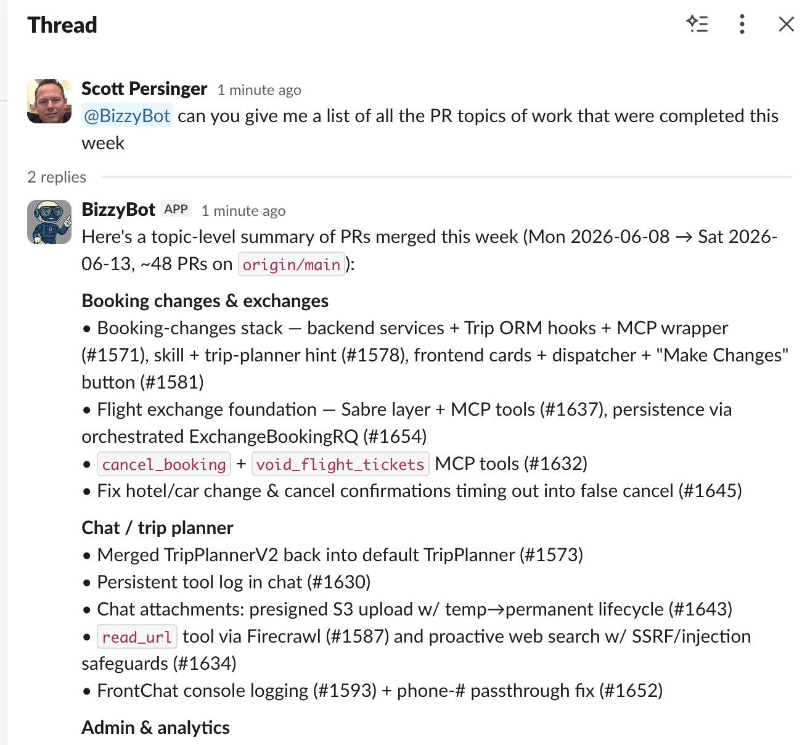

# Bizzybot

Integrate a Claude Code agent into your Slack workspace.



## Getting started

The easiest way to run is to use our pre-created Slack app and `central-dispatch` event service which is
running on Railway. 

Just visit:

[https://claudebot-production-34ba.up.railway.app](https://claudebot-production-34ba.up.railway.app)

login with Slack, add the Slack app to your workspace, then run the agent-wrapper on your machine.


## Key steps

1. Sign-in with your Slack account
2. Add the Slack app to your workspace
3. Configure `Claude Code` on your local machine (see below)
4. Run the `agent-wrapper` on your local machine  
> `uv tool install "git+https://github.com/biztrip-ai/cloud-agents.git#subdirectory=bizzybot/agent-wrapper"`
5. Enter your 'registration key' into the agent-wrapper: this connects it to the Slack listener 

That's it! Invite the Slack app (one of `@cosmo`, `@bizzy` or `@omni`) into a channel and send it
some requests.

## Setting up Claude Code

1. Get Claude Code installed and authenticated, you will need to add an API key or login with a subscription.

2. Setup browser automation via `Claude-in-Chrome` (best) or `Chrome devtools` MCP.

3. Make sure the Github CLI `gh` is installed and authenticated into Github. It should be on the path
so it's usable by Claude.

## Running with OpenRouter models

By default each agent uses whatever `claude` on that machine is authenticated
with (an Anthropic API key or a Claude subscription). You can instead point an
agent at [OpenRouter](https://openrouter.ai) and run it on any model OpenRouter
serves. OpenRouter supports tons of models, including ones you can use for
*free* which still work pretty well with Claude Code. We have tested `tencent/hy3:free`
and it worked pretty well!

Create `~/.bizzybot/settings.env` on the agent's machine and set both keys:

```bash
OPENROUTER_API_KEY=sk-or-v1-...
OPENROUTER_MODEL=tencent/hy3:free
```

Restart the agent-wrapper. It configures Claude Code to talk to OpenRouter's
Anthropic-compatible endpoint following
[OpenRouter's Claude Code guide](https://openrouter.ai/docs/cookbook/coding-agents/claude-code-integration),
and uses your chosen model for the main session, for subagents, and for Claude
Code's internal calls. `CLAUDE_MODEL` is ignored while this is configured, and
setting only one of the two keys does nothing.

Notes:

- **Sign `claude` out first.** If the CLI on that machine is logged into an
  Anthropic account, run `claude /logout` once — otherwise it may prefer those
  cached credentials over the OpenRouter token. This also disables claude.ai
  connectors for the agent, since an env auth source takes precedence over the
  claude.ai login.
- **Model choice matters.** Claude Code leans hard on tool calling, and models
  vary in how well they handle it. Start with an `anthropic/*` model; other
  models may work but expect rougher edges.
- **This is per agent, not global.** Each machine's `settings.env` configures
  only the agent running there, so you can mix providers across agents.
- Every key in `settings.env` is passed through to the agent's Claude Code
  sessions as an environment variable, so it's also where other per-agent
  provider keys or env belong. See
  [`agent-wrapper/settings.env.example`](agent-wrapper/settings.env.example).

## Adding Claude skills

We have a repo of useful skills we recommend: https://github.com/biztrip-ai/common-agent-skills

Install by cloning the repo and linking into `~/.claude/skills`.

You should write your own skills to help Claude run / test / debug your app.

## Running shell commands from Slack

A message starting with `!!` runs the rest as a shell command on the machine
running the agent-wrapper, in the agent's working directory, and posts the
output back to the thread:

```
!! git status
!! npm test
```

Only the agent's **sponsor** — the Slack user who installed it, shown on the
dashboard — can do this. Nobody else can, and a command's output is also given
to the agent with your next message in that thread, so you can follow `!! npm
test` with "fix those failures". `!stop` kills a running command.

## Pushing code from your agent

We created a separate Github user account to use for our bot. This gives you bot a full Github idenity but
costs you a seat.

You can also use a Github App instead and configure the bot as a Github bot user.

## Reviewing pull requests

The agent can watch for pull requests that ask it to review, and review them on its
own. Set `PR_REVIEW_CHANNEL` to a Slack channel ID and the wrapper polls GitHub for
PRs with a pending review request for this machine's `gh` account. For each new one it
opens a thread in that channel, reviews the PR, and submits the review with
`gh pr review`. Reply in the thread to ask follow-ups — the session stays live.

```bash
PR_REVIEW_CHANNEL=C0123456789   # required; unset = feature off
PR_REVIEW_LOGIN=@me             # default: whoever `gh` is authenticated as
PR_POLL_INTERVAL_S=60           # default
```

Invite the bot to that channel first. Requests already pending when the wrapper starts
are skipped, so restarting doesn't re-review a backlog — remove and re-add the reviewer
to trigger one of those.

Two things worth knowing before you turn this on:

- **The trust boundary is the review request itself.** Only PRs where someone with
  write access explicitly requested this account get picked up. That is the whole
  gate. If you point this at public repos, consider restricting it further.
- **The agent posts to GitHub unattended,** and a PR's diff and description are
  attacker-controlled input to a Claude session running in `bypassPermissions`. The
  agent is instructed not to check out or execute the branch and never to `--approve`,
  but those are prompt-level constraints, not a sandbox.
- **Run this on one machine per `gh` account.** The record of what's already been
  reviewed is per-process and isn't persisted, so two wrappers sharing a bot account
  would each keep their own and both review every PR.


# Running from source

Two self-contained apps:

- **`central-dispatch/`** — this is the command application. It receives Slack
  events, persists them to a durable per-agent event log, and pushes them to a
  connected agent over a WebSocket. Multi-tenant across Slack workspaces.

  This app is designed to be the event source for your agent, and we plan on adding things like Email trigger,
  cron jobs, etc... We also want to support running agents in the cloud where a new event
  will "wake up" the cloud environment.

- **`agent-wrapper/`** — a Python program that runs in the agent workspace (laptop, VM,
  container — set up by hand). Dials home to Central-Dispatch to register, receives events
  over the WebSocket, and drives Claude Code.

The two talk over one small WebSocket protocol; the contract is documented in
[`docs/DESIGN.md`](docs/DESIGN.md).

## Quick start

**Central-Dispatch** (Node 22+ — uses the built-in `node:sqlite`, no native build):

```bash
cd central-dispatch
npm install
cp .env.example .env    # then edit
npm start               # http://localhost:3000
```

**Agent-Wrapper** (Python 3.11+ with [`uv`](https://docs.astral.sh/uv/), plus `claude`
and `gh` installed). Install the `bizzybot` command, then run it:

```bash
uv tool install "git+https://github.com/biztrip-ai/cloud-agents.git#subdirectory=bizzybot/agent-wrapper"
CENTRAL_URL=http://localhost:3000 REGISTRATION_TOKEN=<token> bizzybot
```

Or run from source: `cd agent-wrapper && uv run bizzybot`.

## License

AGPL-3.0-or-later. See [`LICENSE`](LICENSE).
